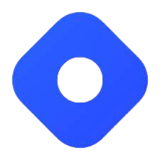

<h4 align="center"> 
  
<h1 align="center">Hi , I'm Harsh Chhabra </h1>
 
 
</img>   

  
 
 

👉 Web Development Intern at <strong>Coding Minutes</strong> 

 
  
I am a <b>Full Stack Web Development</b> Intern at <b>Coding Minutes</b>. Coding Minutes is an ed-tech startup whose motive is to provide great learning resources at a very minimal price. 
   
  Coding Minutes Website: https://www.codingminutes.com
  

👉 Founder of <strong>Codeflow</strong> 

 
Codeflow is a student's driven organization running for students empowerment
  
We are currently working in three domains:
  
1.) Open-Source 
2.) Workshops and webinars from industry experts 
3.) Community building 

👉 <strong>Google DSC Lead</strong> of <strong>NIT Kurukshetra</strong>  

 
  <b>⚫ Firebase for Web Facilitator</b>
  
  <b>⚫ ML Study Jam Facilitator</b>
  
  <b>⚫ Flutter Festival Facilitator</b>
  
  <b>⚫ Android Stduy Jam Facilitator</b>
  
  <b>⚫ 30 Days of Google CLoud Facilitator</b>
  

👉 Beta <strong>Microsoft Learn Student Ambassador</strong>  

 
Microsoft Learn Student Ambassadors are a global group of campus leaders who are eager to help fellow students, create robust tech communities and develop technical and career skills fot the future. 
  <a href="https://studentambassadors.microsoft.com/certificate/c8aec9fd-43ea-46b8-9869-9a9b2b7d4eff">[Profile Link]</a>

👉 <strong>AWS Community Builder</strong>  

 
The AWS Community Builders program offers technical resources, education, and networking opportunities to AWS technical enthusiasts and emerging thought leaders who are passionate about sharing knowledge and connecting with the technical community. 
  <a href="https://aws.amazon.com/developer/community/community-builders/">[Website Link]</a>

👉 Organizer of <strong>Azure Developer Community  Chandigarh</strong>

 
Azure Developer Community is a unique upskilling platform aimed at helping developers learn, upskill, and network by attending regular community-events, and sharing knowledge and growing along with the other community members. 
  <a href="https://azdev.reskilll.com">[Website Link]</a>

👉 <strong>Postman Student Leader</strong> 

 
<b> ⚫ Postman Student Leader</b>

  Postman Student Leaders teach others the essential skills in using Postman to build and test APIs.Postman Student Leaders teach others the essential skills in using Postman to build and test APIs. 
  <a href="https://drive.google.com/file/d/1weqeWkHDab2ZABw1vBaANeugAceJN30t/view?usp=sharing">[Certificate Link]</a>

<b> ⚫ Postman Student Expert</b>
  
  Postman Student Experts are proficient in the essential skills involved in building and testing API requests in Postman. 
  <a href="https://drive.google.com/file/d/1d1htnOR2_21OxyCE0Pr1VZdRrdFNaCsA/view?usp=sharing">[Certificate Link]</a>

👉 Community Student Partner (CSP) at <strong>C# Corner</strong> 

  
 
C# Corner is an global social community for IT professionals and data developers to exchange their knowledge and experience using various methods such as contributing articles, forums, blogs, and videos. 
    <a href="https://www.c-sharpcorner.com/">[Website Link]</a>
    

  

I love to spend time at <strong>GitHub</strong> :octocat:

📝 I regularly write articles on <strong>Medium</strong>   
 and <strong>Hashnode</strong> 

⚡ In my free time, I love to play Chess  , listen to songs   and watching movies  
</h4> 

 

 

<h2> Skills & Tools  </h2> 

<!--  --->

 

## Connect with me:</h3>

  
 
   
   
    
    
  
  
   
     
  
  

 
 
 
 
 

  <h4>🏆 Github Profile Trophies</h4>
  

## Badges
  

## Support

  
 

